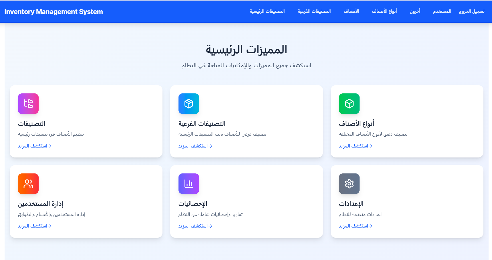
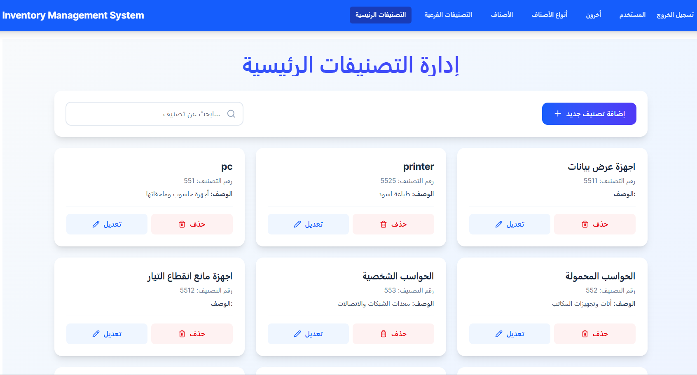
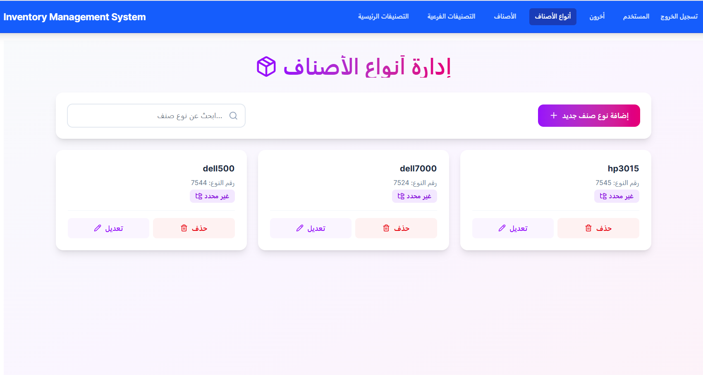
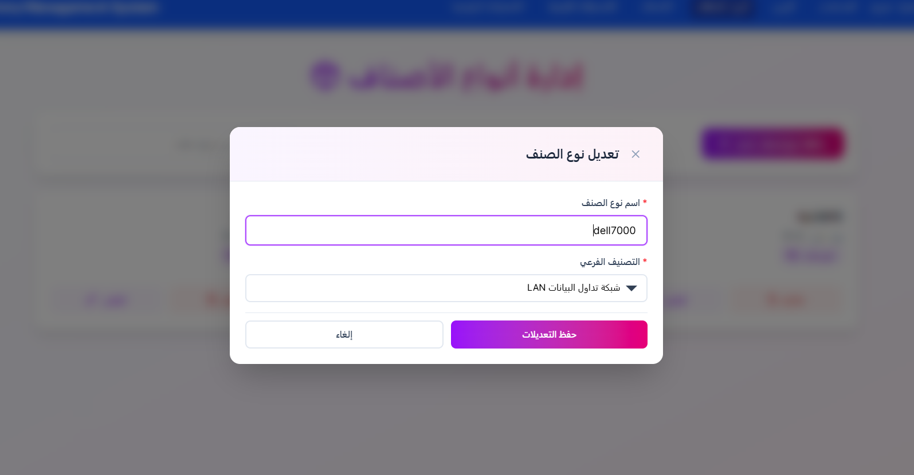
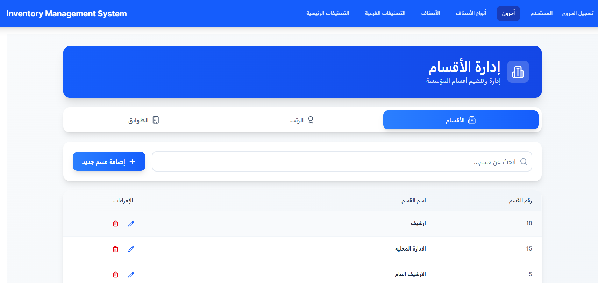
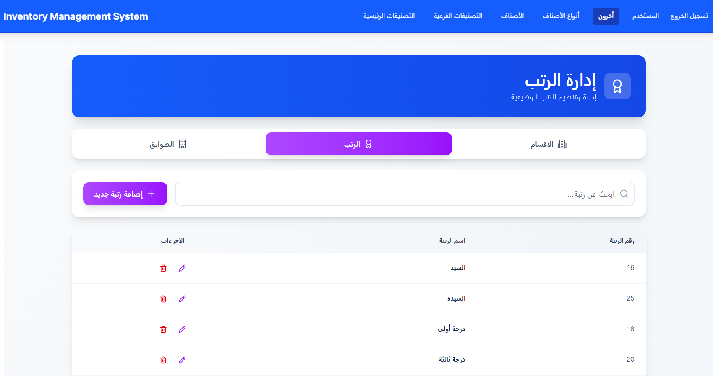
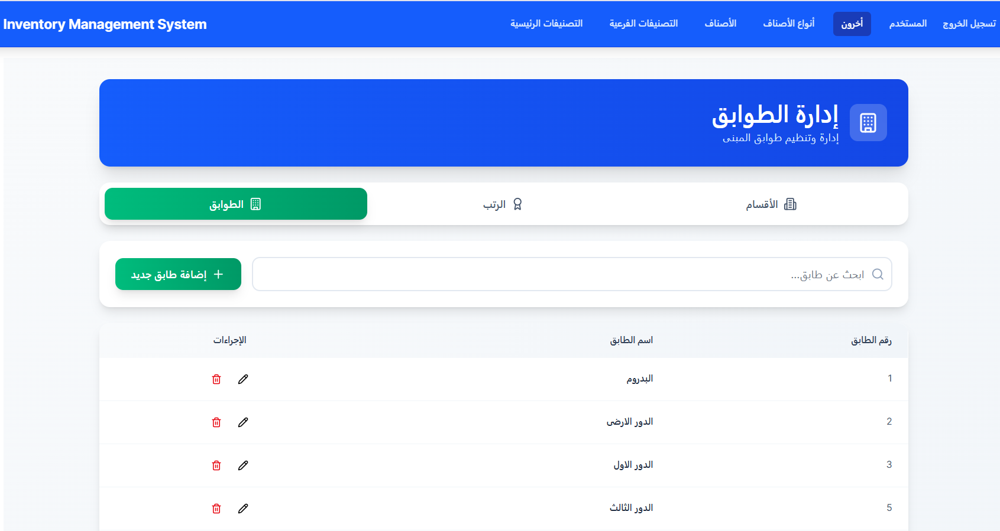
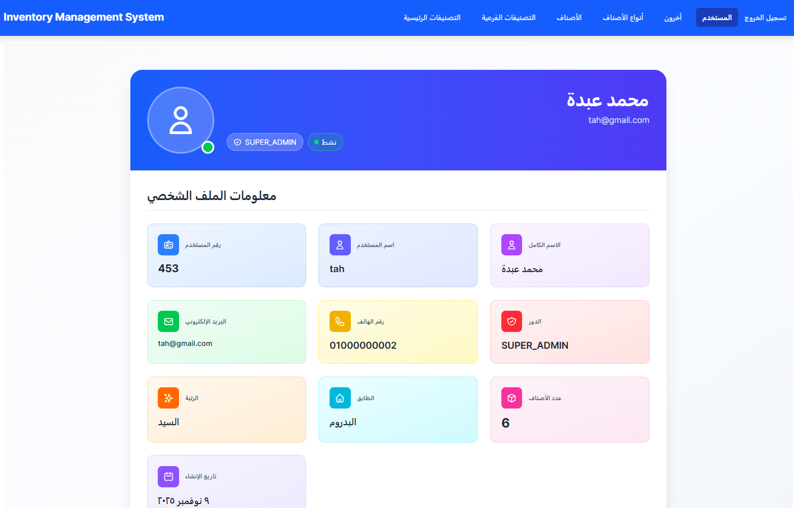
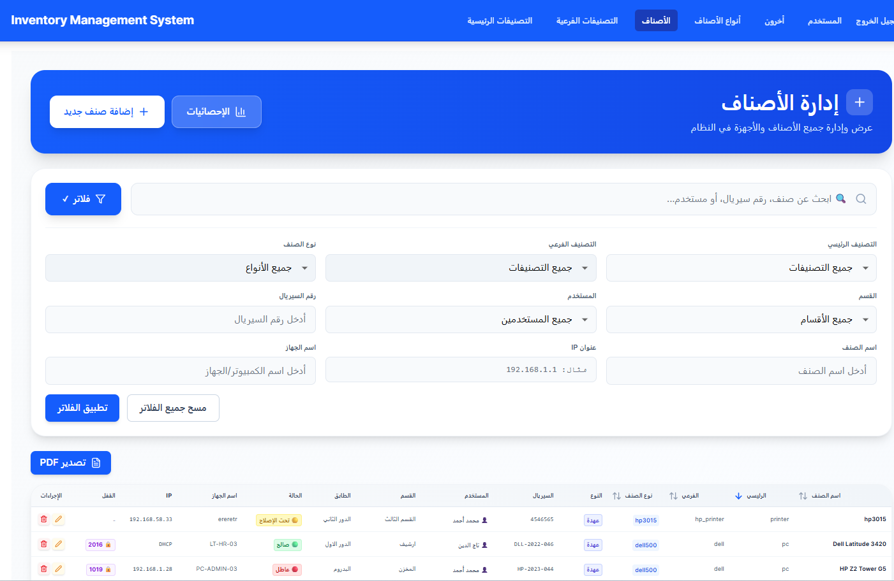

# نظام إدارة المخزون والمعدات

<div align="center">
  <h2>📦 نظام إدارة المخزون والمعدات</h2>
  <p>نظام شامل لإدارة وتتبع الأجهزة والمعدات في المؤسسات</p>
  
  [](https://nextjs.org/)
  [](https://www.typescriptlang.org/)
  [](https://tailwindcss.com/)
  [](https://reactjs.org/)
</div>

## 📋 نظرة عامة

نظام إدارة المخزون والمعدات هو تطبيق ويب شامل تم تطويره باستخدام أحدث التقنيات لتسهيل إدارة وتتبع الأجهزة والمعدات في المؤسسات. يوفر النظام واجهة سهلة الاستخدام مع إمكانيات متقدمة للتصنيف والتتبع والتقارير.

## ✨ المميزات الرئيسية

### 🔐 الأمان والمصادقة

- نظام مصادقة آمن باستخدام NextAuth.js
- إدارة صلاحيات متقدمة باستخدام CASL (Ability-based access control)
- حماية المسارات والموارد بناءً على الأدوار
- تسجيل خروج تلقائي بعد فترة من عدم النشاط

### 📦 إدارة الأصناف

- **إدارة شاملة للأصناف**: إضافة، تعديل، حذف، وعرض جميع الأصناف
- **تصنيف هرمي متعدد المستويات**:
  - التصنيفات الرئيسية
  - التصنيفات الفرعية
  - أنواع الأصناف
- **فلاتر متقدمة**:
  - فلترة حسب التصنيف الرئيسي والفرعي
  - فلترة حسب نوع الصنف
  - فلترة حسب رقم السريال
  - فلترة حسب الاسم
  - فلترة حسب القسم والمستخدم
  - فلترة حسب IP واسم الجهاز
- **ترتيب ديناميكي**: إمكانية ترتيب الأصناف حسب الأعمدة المختلفة
- **تصدير PDF**: إنشاء تقارير PDF منظمة بتنسيق احترافي

### 👥 إدارة المستخدمين

- إدارة كاملة للمستخدمين والأدوار
- نظام صلاحيات مرن
- إعادة تعيين كلمات المرور
- ملفات تعريف المستخدمين

### 📊 الإحصائيات والتقارير

- **لوحة إحصائيات شاملة**:
  - إحصائيات التصنيفات الرئيسية والفرعية
  - إحصائيات أنواع الأصناف
  - إحصائيات الأقسام والطوابق
  - إحصائيات الحالات والأنواع
  - إحصائيات المستخدمين والمخازن
- **تقارير PDF**:
  - تقارير التصنيفات الرئيسية بتنسيق رسمي
  - تقارير الأصناف مع جدولة هرمية متقدمة

### 🏢 إدارة التنظيم

- إدارة الأقسام (Departments)
- إدارة الطوابق (Floors)
- ربط الأصناف بالمواقع

## 📸 لقطات من النظام

### الصفحة الرئيسية


### إدارة الأصناف



### الفلاتر والبحث



### الإحصائيات


### إدارة المستخدمين



### الملف الشخصي



### تقارير PDF



### عرض الأصناف



### إحصائيات تفصيلية



### واجهة متجاوبة



### طباعة التقارير



## 🛠️ التقنيات المستخدمة

### Frontend

- **Next.js 15.4.3** - إطار عمل React مع App Router
- **React 19.1.0** - مكتبة واجهة المستخدم
- **TypeScript 5.8.3** - للكتابة الآمنة والموثوقة
- **Tailwind CSS 4.1.11** - لأسلوب تصميم حديث وسريع
- **Lucide React** - مجموعة رموز جميلة وعصرية

### Backend & Database

- **Oracle Database** - قاعدة بيانات قوية وموثوقة
- **Next.js API Routes** - واجهة برمجة التطبيقات
- **oracledb 6.10.0** - محرك قاعدة بيانات Oracle

### Authentication & Authorization

- **NextAuth.js 5.0** - نظام مصادقة شامل
- **CASL (@casl/ability)** - إدارة الصلاحيات المرنة
- **bcryptjs** - تشفير كلمات المرور

### Additional Libraries

- **Zod** - التحقق من صحة البيانات
- **Axios** - طلبات HTTP
- **React Toastify** - إشعارات المستخدم

## 📁 هيكل المشروع

```
inventory/
├── src/
│   ├── app/                    # صفحات Next.js (App Router)
│   │   ├── (user)/            # صفحات المستخدمين (مجموعة محمية)
│   │   │   ├── login/         # صفحة تسجيل الدخول
│   │   │   ├── register/      # صفحة التسجيل
│   │   │   └── profile/       # صفحة الملف الشخصي
│   │   ├── api/               # API Routes
│   │   │   ├── items/         # واجهات إدارة الأصناف
│   │   │   ├── users/         # واجهات إدارة المستخدمين
│   │   │   ├── statistics/    # واجهات الإحصائيات
│   │   │   └── ...
│   │   ├── items/             # صفحة عرض الأصناف
│   │   ├── statistics/        # صفحة الإحصائيات
│   │   └── ...
│   ├── components/            # المكونات القابلة لإعادة الاستخدام
│   │   ├── Items.tsx         # مكون إدارة الأصناف
│   │   ├── UserManagement.tsx # مكون إدارة المستخدمين
│   │   └── ...
│   ├── lib/                   # المكتبات والمساعدات
│   │   ├── database.ts       # اتصال قاعدة البيانات
│   │   ├── db_utils.ts       # دوال قاعدة البيانات
│   │   ├── ability.ts        # إعداد CASL
│   │   ├── roleManager.ts    # إدارة الأدوار
│   │   └── ...
│   ├── contexts/              # React Contexts
│   │   └── AbilityContext.tsx # سياق الصلاحيات
│   └── hooks/                 # Custom Hooks
│
├── public/                    # الملفات الثابتة
│   ├── images/               # الصور
│   │   └── read-md/          # صور README
│   └── ...
│
└── ...
```

## 🚀 البدء السريع

### المتطلبات الأساسية

- **Node.js** 18.x أو أحدث
- **pnpm** (مفضل) أو npm أو yarn
- **Oracle Database** مع تفعيل Oracle Client
- **Git**

### التثبيت

1. **استنساخ المشروع**

   ```bash
   git clone https://github.com/Tah5721312/inventory_far3
   cd inventory
   ```

2. **تثبيت الحزم**

   ```bash
   pnpm install
   ```

3. **إعداد متغيرات البيئة**

   أنشئ ملف `.env.local` في جذر المشروع:

   ```env
   # Database Configuration
   ORACLE_USER=your_username
   ORACLE_PASSWORD=your_password
   ORACLE_CONNECTION_STRING=your_connection_string

   # NextAuth Configuration
   NEXTAUTH_SECRET=your_secret_key_here
   NEXTAUTH_URL=http://localhost:3000
   AUTH_URL=http://localhost:3000

   # Application Configuration
   NODE_ENV=development
   ```

4. **تشغيل خادم التطوير**

   ```bash
   pnpm dev
   ```

5. **فتح المتصفح**

   افتح [http://localhost:3000](http://localhost:3000) في المتصفح

## 📝 سكريبتات متاحة

```bash
# تشغيل خادم التطوير
pnpm dev

# بناء المشروع للإنتاج
pnpm build

# تشغيل النسخة المنتجة
pnpm start

# فحص الأخطاء البرمجية
pnpm lint

# إصلاح الأخطاء البرمجية تلقائياً
pnpm lint:fix

# فحص الأنواع
pnpm typecheck

# تشغيل الاختبارات
pnpm test

# تنسيق الكود
pnpm format

# فحص تنسيق الكود
pnpm format:check
```

## 🔧 الإعدادات

### إعداد قاعدة بيانات Oracle

1. تأكد من تثبيت Oracle Client على النظام
2. قم بإعداد متغيرات البيئة في `.env.local`
3. تأكد من أن معلومات الاتصال صحيحة

### إعداد NextAuth

1. قم بإنشاء `NEXTAUTH_SECRET` عشوائي:
   ```bash
   openssl rand -base64 32
   ```
2. ضع `NEXTAUTH_URL` و `AUTH_URL` حسب بيئة العمل

### إعداد CASL (الصلاحيات)

قم بتعديل ملفات الصلاحيات في `src/lib/ability.ts` و `src/lib/ability.server.ts` حسب احتياجات المشروع.

## 🎨 الميزات المتقدمة

### نظام الفلترة المتقدم

النظام يدعم فلترة متعددة الأبعاد للأصناف مع دعم الفلاتر التابعة (dependent filters).

### التقارير الذكية

- تقارير PDF بتنسيق احترافي
- جدولة هرمية متقدمة مع دعم `rowspan`
- تصدير البيانات المنظمة

### واجهة مستخدم حديثة

- تصميم متجاوب (Responsive Design)
- دعم الأجهزة المحمولة
- واجهة مستخدم عصرية باستخدام Tailwind CSS

## 📖 الوثائق

### الصفحات الرئيسية

- `/items` - صفحة إدارة الأصناف
- `/statistics` - صفحة الإحصائيات والتقارير
- `/users` - صفحة إدارة المستخدمين
- `/login` - صفحة تسجيل الدخول

### API Endpoints

- `/api/items` - واجهات إدارة الأصناف
- `/api/users` - واجهات إدارة المستخدمين
- `/api/statistics` - واجهات الإحصائيات
- `/api/auth/*` - واجهات المصادقة

## 🧪 الاختبارات

```bash
# تشغيل جميع الاختبارات
pnpm test

# تشغيل الاختبارات في وضع المراقبة
pnpm test:watch
```

## 📦 البناء للنشر

```bash
# بناء المشروع
pnpm build

# تشغيل النسخة المنتجة محلياً
pnpm start
```

## 📞 التواصل

للمزيد من المعلومات أو الدعم، يرجى التواصل عبر:

- 📧 البريد الإلكتروني: [tah5721312@gmail.com](mailto:tah5721312@gmail.com)
- 🐛 فتح Issue في المستودع

## 🙏 شكر وتقدير

شكراً لجميع المساهمين في هذا المشروع.

---

<div align="center">
  <p>تم التطوير بـ ❤️ باستخدام Next.js و TypeScript</p>
  <p>© 2025 نظام إدارة المخزون والمعدات</p>
</div>
